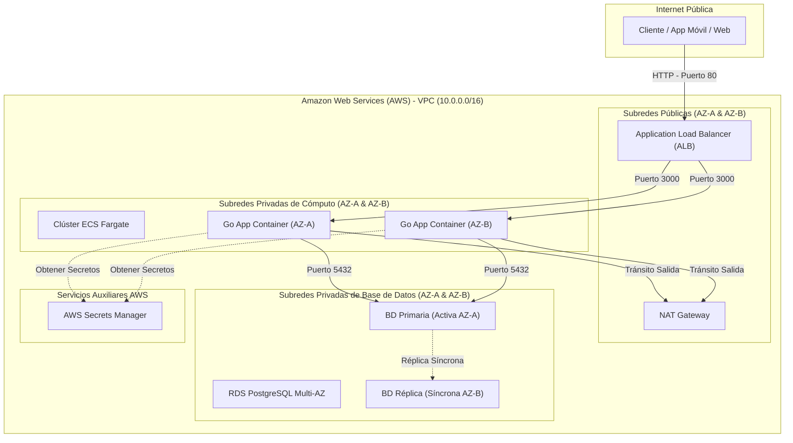

# Microservicio de Gestión de Cuentas y Transacciones - NovoBanco

Este microservicio ha sido diseñado para gestionar el ciclo de vida de cuentas y transacciones bajo estrictos requerimientos de consistencia financiera, control de concurrrencia y alta disponibilidad.

Desarrollado en **Go (Golang)** con una arquitectura limpia (**Clean Architecture**), persistencia en **PostgreSQL**, infraestructura declarada con **Terraform** y testing concurrente automatizado.

---

## 1. Diseño de Arquitectura Cloud en AWS

La infraestructura está modelada siguiendo los principios de alta disponibilidad (Multi-AZ) y red de confianza cero en AWS:



### Componentes Clave:
- **Redes Seguras**: El balanceador (ALB) reside en la subred pública. El cómputo (ECS Fargate) y la base de datos (RDS) están totalmente aislados en subredes privadas.
- **Cómputo Fargate**: Se despliega a lo largo de 2 AZs con 2 contenedores paralelos. Esto tolera caídas a nivel de hardware/AZ sin interrupción.
- **RDS PostgreSQL Multi-AZ**: El motor principal reside en AZ-A y mantiene una réplica física replicada de forma síncrona en AZ-B. Si la principal falla, AWS realiza una conmutación por error (failover) en unos segundos.
- **Gestión de Secretos**: La aplicación lee las variables de base de datos desde AWS Secrets Manager inyectándolas como variables de entorno al contenedor en tiempo de arranque.

## 2. Decisiones de Diseño y Negocio (ADRs)

### ADR 1: Prevención de Saldo Negativo y Concurrencia
- **Contexto**: Dos retiros simultáneos no deben permitir que el saldo de la cuenta baje de cero.
- **Decisión**: Bloqueo Pesimista (Pessimistic Locking) + Check Constraint.
- **Justificación**: Cuando inicia un débito (retiro o transferencia), el microservicio ejecuta un `SELECT ... FOR UPDATE` sobre las cuentas involucradas. Esto bloquea la fila en PostgreSQL a nivel de transacción. Si ocurre otra solicitud paralela, esta esperará a que la primera finalice. Como último cinturón de seguridad, la tabla `accounts` contiene la restricción física `CHECK (balance >= 0.00)`, impidiendo a nivel físico cualquier sobregiro accidental.

### ADR 2: Prevención de Deadlocks (Abrazos Mortales)
- **Contexto**: Si ocurre una transferencia de A -> B y otra de B -> A de forma simultánea, y el Proceso 1 bloquea A y espera por B, mientras el Proceso 2 bloquea B y espera por A, se produce un Deadlock.
- **Decisión**: Ordenamiento Determinista de Bloqueos (Lock Ordering).
- **Justificación**: En el caso de uso `Transfer`, el código ordena los números de cuenta de manera alfanumérica y siempre ejecuta el bloqueo pesimista en la cuenta menor primero. Esto obliga a que el segundo proceso intente bloquear la misma cuenta inicial y espere ordenadamente, erradicando los deadlocks.

### ADR 3: Idempotencia en Transacciones
- **Contexto**: El sistema puede recibir peticiones duplicadas debido a reintentos de red.
- **Decisión**: Unique Constraint en `reference_unique` de `Transactions`.
- **Justificación**: La tabla `transactions` tiene un índice único en la columna `reference_unique`. Si se reenvía una petición con la misma referencia, la base de datos abortará la inserción lanzando un error de llave duplicada (23505). El microservicio atrapa este error y responde un código HTTP 409 Conflict, previniendo abonos o cargos dobles.

## 3. Estructura del Código (Clean Architecture)

```text
├── cmd/server/                 # Punto de entrada (main.go)
├── internal/
│   ├── domain/                 # Entidades puras y contratos (interfaces)
│   ├── usecase/                # Lógica de negocio (casos de uso)
│   └── infrastructure/         # Base de Datos PostgreSQL, Handlers HTTP y enrutador
├── scripts/                    # Scripts DDL para la base de datos
├── terraform/                  # Código de infraestructura en AWS
└── .github/workflows/          # Pipeline de GitHub Actions
```

## 4. Instrucciones para levantar el proyecto localmente

### Prerrequisitos:
- Docker y Docker Compose instalados.
- Go (v1.20+) instalado localmente (para compilación y pruebas).

### Pasos para levantar el servicio:
1. **Levantar Base de Datos**:
   ```bash
   docker-compose up -d
   ```
2. **Inicializar Esquema de Base de Datos**:
   ```bash
   docker exec -i novobanco-db psql -U postgres -d novobanco < scripts/schema.sql
   ```
3. **Iniciar Servidor HTTP**:
   ```bash
   go run cmd/server/main.go
   ```
   El servidor estará corriendo en el puerto 3000.

## 5. Ejecutar la Suite de Pruebas

Para validar el correcto funcionamiento, incluyendo la prueba de estrés concurrente:

```bash
go test -v ./...
```
